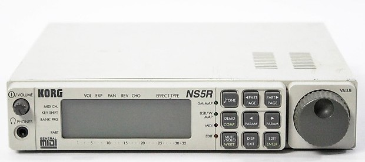

# Portfolio Landing Page
###### First Friday Independent Project, 10.16.20
### by Taylor Delph

## Description
This webpage is the _first_ independent Friday project for Epicodus. It's an exercise in **almost everything** taught to us in week 1. Thanks for checking out my website!

## Setup
* Grab your mug of coffee
* Navigate to my github pages [porfolio site](https://taylulz.github.io/Portfolio/)
* Try resizing the page
* Check out some of the links
* Click the picture links to learn more about the synths:
 

## Technologies used
Basic markup language

HTML

CSS

Bootstrap

# What I learned in making this webpage
How to have images as links

How have link navigate to specified page number

# Leagl
Copyright (c) 2020 Taylor Delph
This website is licensed under the MIT license.